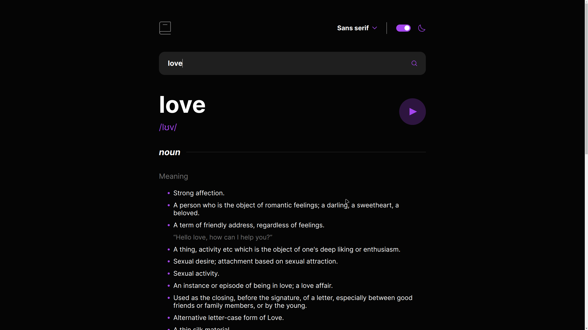

# Dictionary web app solution (Frontend Mentor)

This is a solution to the [Dictionary web app challenge on Frontend Mentor](https://www.frontendmentor.io/challenges/dictionary-web-app-h5wwnyuKFL).

## Table of contents

- [Overview](#overview)
  - [The solution](#the-solution)
  - [Screenshot](#screenshot)
  - [Links](#links)
  - [Built with](#built-with)
- [Author](#author)

## Overview

### The solution

Users are able to:

- Search for words using the input field
- See the Free Dictionary API's response for the searched word
- See a form validation message when trying to submit a blank form
- Play the audio file for a word when it's available
- Switch between serif, sans serif, and monospace fonts
- Switch between light and dark themes
- View the optimal layout for the interface depending on their device's screen size
- See hover and focus states for all interactive elements on the page

### Screenshot

### Links

- Solution URL: [Github repository](https://github.com/davidkadaria/dictionary-web-app)
- Live Site URL: [Vercel](https://dictionary-web-app-five-gold.vercel.app)

### Built with

- [React](https://reactjs.org/) - JS library
- Mobile-first workflow
- Semantic HTML5 (JSX) markup
- BEM and OOCSS methodologies in combination

## Author

- Website - [qada.ge](https://qada.ge)
- LinkedIn - [Q4D4](https://www.linkedin.com/in/q4d4/)
- Twitter - [@DavidKadaria](https://www.twitter.com/DavidKadaria)
- Frontend Mentor - [@DavidKadaria](https://www.frontendmentor.io/profile/davidkadaria)
